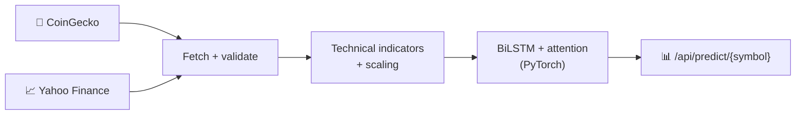

<div align="center">


# Cryptocurrency Price Prediction with Deep Learning — BiLSTM + Attention REST API (v1)

**A FastAPI service that forecasts Bitcoin, Ethereum and altcoin prices with a PyTorch bidirectional LSTM, backed by CoinGecko and Yahoo Finance market data.**

<p>
  
  
  
  
  
  
</p>

</div>

---

> [!IMPORTANT]
> **This is v1.** Development continues in **[CryptoAion AI → cryptoaion-price-prediction](https://github.com/intikhab49/cryptoaion-price-prediction)** — refactored config, WebSocket streaming, JWT auth and on-demand training. Start there unless you specifically want this earlier snapshot.

## ✨ Features

- 🧠 **BiLSTM with attention** price prediction in PyTorch, with early stopping
- ⏱️ **Multiple timeframes** — `30m`, `1h`, `4h`, `24h`
- 🌐 **Two data sources** — CoinGecko (free or Pro, automatic fallback to free) and Yahoo Finance as backup with deeper history
- 📐 **Technical indicators**, data-quality validation and support/resistance detection
- 📓 **Research notebooks** — hourly BTC BiLSTM notebook and an XGBoost trading-bot notebook with saved BTC/ETH/BNB models
- 📊 **Streamlit dashboard** and saved pipeline/test result logs
- 🐳 Dockerfile, Procfile and Vercel config for deployment

**Supported coins:** BTC · ETH · BNB · XRP · ADA · DOGE · SOL

## 🔄 Pipeline



## ⚡ Quick start

```bash
git clone https://github.com/intikhab49/crypto-price-prediction-api.git
cd crypto-price-prediction-api

python -m venv env
source env/bin/activate            # Windows: .\env\Scripts\activate
pip install -r requirements.txt
```

Create a `.env` file:

```ini
COINGECKO_API_KEY=your_api_key_here
DATABASE_URL=sqlite://db.sqlite3
MODEL_PATH=models
CACHE_DIR=cache
LOG_LEVEL=INFO
LOG_FILE=crypto_prediction.log
PORT=8000
HOST=0.0.0.0
```

```bash
python run_migrations.py
uvicorn main:app --reload
```

Docs at **http://localhost:8000/docs** and **http://localhost:8000/redoc**.

## 📡 API endpoints

| Method | Endpoint | Description |
|---|---|---|
| GET | `/api/predict/{symbol}` | Price prediction for a symbol |
| GET | `/api/coingecko/realtime` | Real-time market data |
| GET | `/api/coingecko/historical/{coin_id}` · `/by-symbol/{symbol}` · `/{coin_id}` | CoinGecko coin data |
| GET | `/api/yfinance/historical/{symbol}` · `/info/{symbol}` | Yahoo Finance data |
| GET | `/api/health` | Health check |

See [`API_DOCUMENTATION.md`](API_DOCUMENTATION.md) and [`FRONTEND_INTEGRATION_GUIDE.md`](FRONTEND_INTEGRATION_GUIDE.md) for request/response details.

## ⚙️ Environment variables

| Variable | Description |
|---|---|
| `COINGECKO_API_KEY` | CoinGecko API key (needed for Pro API) |
| `DATABASE_URL` | Database connection string (default: SQLite) |
| `MODEL_PATH` · `CACHE_DIR` | Saved models · cached market data |
| `LOG_LEVEL` · `LOG_FILE` | Logging |
| `PORT` · `HOST` | Server binding |

## ⚠️ Disclaimer

Research and educational software — **not financial advice**.

---

<div align="center">

**Built by [Intikhab Azam](https://github.com/intikhab49)** — AI engineer · machine learning · automation

<sub>Keywords: crypto price prediction · Bitcoin forecasting · LSTM · BiLSTM · deep learning · PyTorch · FastAPI · CoinGecko · Yahoo Finance · XGBoost · Python</sub>

</div>
